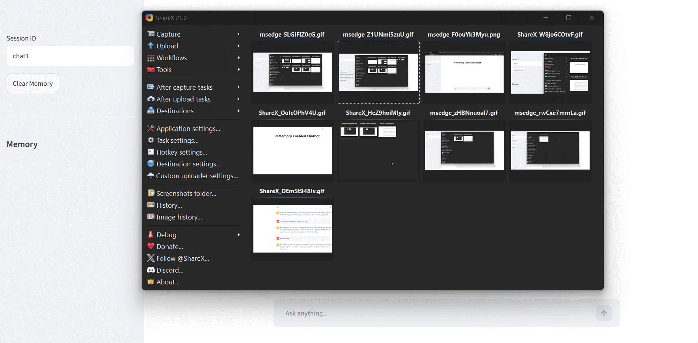

# 🧠 Memory-Enabled AI Chatbot

A conversational AI chatbot built using **Python, LangChain, Groq (Llama 3.1), and Streamlit** that remembers previous messages and provides context-aware responses.

---

## 🎥 Demo



---

## 📖 Overview

This project demonstrates how to build a conversational AI application with memory.

Unlike a basic chatbot that forgets previous messages, this chatbot maintains conversation context during a session, making interactions more natural and engaging.

The application uses **LangChain** for LLM orchestration, **Groq's Llama 3.1 model** for fast inference, and **Streamlit** for creating an interactive user interface.

---

## ✨ Features

- 🧠 Conversation Memory
- 💬 Context-Aware Responses
- 📜 Session-Based Chat History
- ⚡ Fast Inference using Groq
- 🎨 Interactive Streamlit Interface

---

## 🛠️ Tech Stack

- Python
- LangChain
- Groq (Llama 3.1)
- Streamlit

---

## 📂 Project Structure

```
memory-enabled-ai-chatbot/
│
├── app.py
├── requirements.txt
├── README.md
├── .gitignore
├── LICENSE
└── assets/
    └── demo.gif
```

---

## ⚙️ Installation

### 1. Clone the repository

```bash
git clone https://github.com/jiyadhillon16-hub/Memory-Enabled-Chatbot.git
```

### 2. Navigate to the project directory

```bash
cd Memory-Enabled-Chatbot
```

### 3. Install dependencies

```bash
pip install -r requirements.txt
```

---

## 🔑 Environment Setup

Create an environment variable for your Groq API key.

Example:

```env
GROQ_API_KEY=your_api_key_here
```

Make sure to keep your API key private and never upload it to GitHub.

---

## ▶️ Run the Application

Start the Streamlit application:

```bash
streamlit run app.py
```

The application will open in your browser.

---

## 🧠 How It Works

```
User
  |
  ▼
Streamlit UI
  |
  ▼
LangChain
  |
  ▼
RunnableWithMessageHistory
  |
  ▼
Conversation Memory
  |
  ▼
Groq (Llama 3.1)
  |
  ▼
AI Response
```

The chatbot uses LangChain's `RunnableWithMessageHistory` along with Streamlit session handling to maintain conversation history and generate responses based on previous interactions.

---

## 📚 What I Learned

While building this project, I learned:

- Integrating Large Language Models using LangChain
- Managing conversation history with `RunnableWithMessageHistory`
- Handling Streamlit session state
- Building interactive AI applications
- Debugging real-world issues during development

---

## 🚀 Future Improvements

- Add RAG-based document chat
- Add PDF question answering
- Add persistent chat history using databases
- Add voice interaction
- Add multi-user support

---

## 📄 License

This project is licensed under the MIT License.
